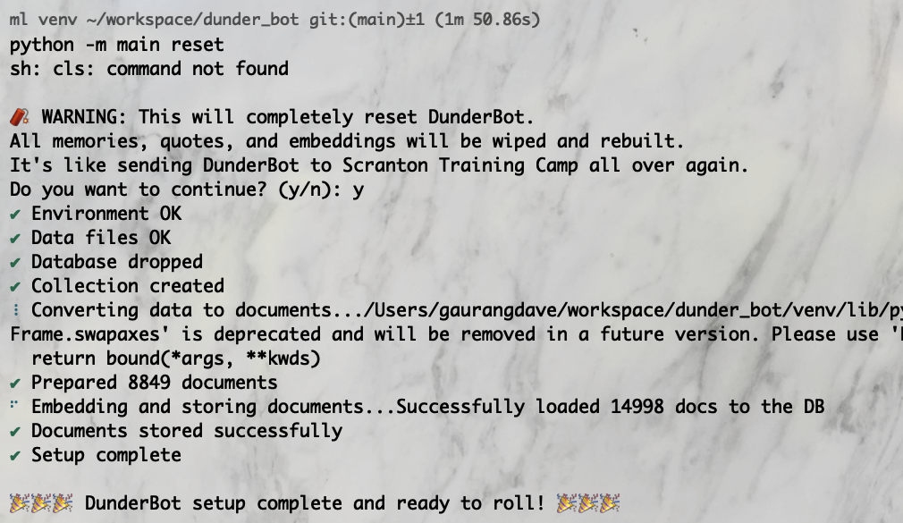
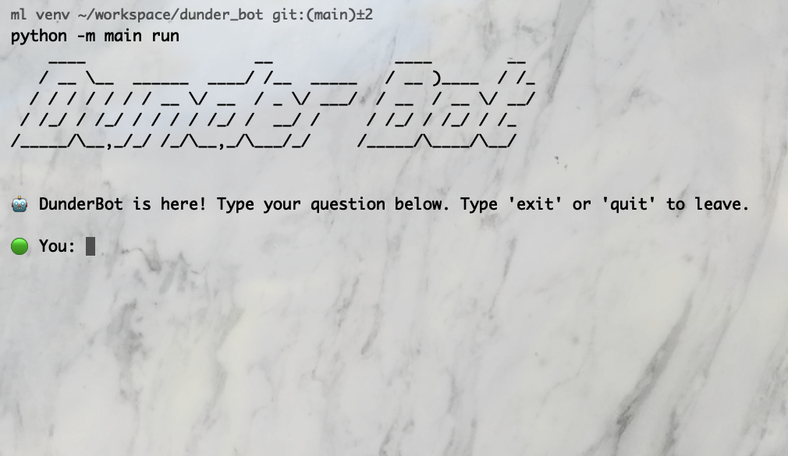
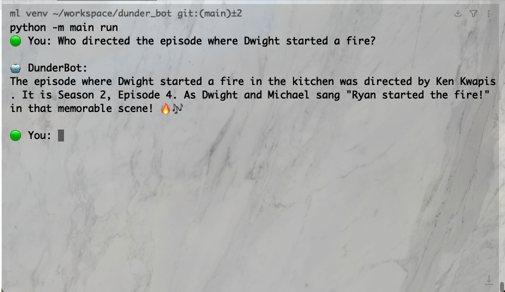

# DunderBot 🤖 – The Office RAG Application


## 🎯 Project Goal
The goal of this project is to build an end-to-end chatbot powered by Retrieval-Augmented Generation (RAG) using large language models (LLMs), trained on **The Office** TV show dataset.

This isn't just a tech demo — it's a fun, interactive bot that lets users:
- 🔍 Search for episodes or quotes by mood, phrases, or characters.
- 🎭 Ask contextual questions like “Who directed the episode where Dwight started a fire?”
- 🤖 Retrieve smart and hilarious responses based on episode metadata and dialog context.

### 🧩 Core Features
1. **Retrieval Pipeline** – Pulls relevant chunks from a vector database (ChromaDB) using semantic search.
2. **CLI Chatbot** – A slick, interactive command-line bot powered by LangChain and OpenAI.
3. **Context-Aware Answers** – Combines retrieved quotes with LLM prompting to answer user queries with show-specific flavor.

A FastAPI backend and web UI are planned in future iterations — current version is CLI-first and fully local.

## ✅ Solution Details

This project was built iteratively, starting with a hands-on prototype and evolving into a fully interactive CLI application. The current solution combines vector search with an LLM-powered reasoning layer to provide accurate and contextual answers from **The Office** dataset.

### 🔧 Development Phases
1. **Proof of Concept (POC)** –  
   Started with a Jupyter Notebook to explore and prototype the core building blocks:
   - [x] ChromaDB for vector similarity search
   - [x] LangChain for document chunking and retrieval
   - [x] OpenAI API for generating natural language answers

2. **CLI Application** –  
   The POC was converted into a modular CLI tool using:
   - Typer (for command-line interface)
   - Rich/Halo (for CLI bells and whistles ✨)
   - Reusable setup and run scripts to reset and interact with the bot

The app loads quote and episode metadata, splits documents, embeds them using OpenAI, and stores them in a local ChromaDB collection. At runtime, it performs semantic search and uses LangChain to prompt the LLM with relevant chunks.

### 🧭 RAG Workflow Overview
        +------------------+
        |   User Query     |
        +--------+---------+
                 |
                 v
        +--------+---------+
        |   ChromaDB        |  ← (Vector DB with episode chunks)
        |  Similarity Search|
        +--------+---------+
                 |
       Top-k Relevant Chunks
                 |
                 v
       +---------+----------+
       |   LangChain Prompt |
       |  + OpenAI Response |
       +---------+----------+
                 |
                 v
        +--------+---------+
        |    CLI Response   |
        +------------------+

### 🧮 Performance Measure
#### 🧠 Response Strategy

This app doesn’t rely on traditional accuracy or F1 scores. Instead, its performance is evaluated by how well it:

- Retrieves semantically relevant chunks from the vector store.
- Maintains character/contextual accuracy in responses.
- Handles casual and complex user queries about **The Office** episodes.

The OpenAI model is prompted using retrieved chunks and show metadata, giving it just enough information to respond with context but without hallucinating facts.


<!-- ### 🚧 Data Transformation -->

### 📂 Dataset

This project uses a combination of dialog transcripts and episode metadata from **The Office (US)**, sourced from:

- 📄 [The Office Story GitHub Repo](https://github.com/swarnitav08/The-Office-Story/tree/main)
- 🗨️ [Kaggle Discussion Reference](https://www.kaggle.com/discussions/general/182604)

#### 🧪 Merged Dataset

The data was transformed into a format suitable for Retrieval-Augmented Generation:

- Dialogues were grouped by episode and broken into pseudo-scenes using the `total_scenes` column.
- Speaker labels were preserved (`Michael: I'm not superstitious, but I am a little stitious.`).
- Episode metadata (season, title, director, writer, rating) was merged for enriched retrieval and prompting.
- Start and end markers were added to each episode chunk for contextual awareness.

The final documents are stored as chunks (avg. ~400 characters) with metadata and embedded using OpenAI’s Embedding API.
### 📒  Notebooks

<!-- ### 🧠 Model Insights -->

## 💻 Tech Stack

### 👨‍💻 Core Language & Tools
  
  


### 🧠 LLM & RAG Framework
  
  
  

### 🧪 Data Preparation
  

### 💬 CLI & UX
  
  
  


### 🗃️ Storage & Config
  
  
  

### 🛠️ Tools and Platforms:
1. **Python**: Used for preprocessing, pipeline development, and embedding generation.
2. **ChromaDB**: For storing and retrieving dialog and metadata embeddings.
3. **OpenAI, Ollama, Gemini, DeepSeek APIs**: For generating responses to user queries.

## 💻 Running Locally

### Install Dependencies

- Create conda environment with `Python 3.12`

```bash
  conda create -n ml python=3.12
```

- Activate the environment

```bash
  conda activate ml
```

- Using venv
```bash
python3 -m venv .venv
source .venv/bin/activate  # On Windows use: .venv\Scripts\activate
```

 - Install Dependencies
 ```bash
 pip install -r requirements.txt
 ```
---

### 🔐 Configure Environment Variables

Before running the bot, you need to create a `.env` file with your OpenAI API key:

* Copy the `.env.template` to create your local `.env`:
```bash
cp .env.template .env
```

*	Open .env and add your OpenAI API key:
```bash
OPENAI_API_KEY=your-key-goes-here
```
This key is required to generate embeddings and produce LLM responses.
> 📝 Your .env file should never be committed to GitHub — it’s already in .gitignore.

### 🛠 Default Configuration (`config.json`)

```json
{
  "default_db_path": "./db/dunder_bot",
  "default_collection": "openai_embeddings",
  "default_model": "gpt-4.1-mini",
  "retrieval_k": 5
}
```
You can edit this file to try different models or retrieval settings without touching the code.

#### 💸 Note on API Costs

This project uses the OpenAI API to generate embeddings and respond to user queries. Please be aware:
* Each call to gpt-4.1-mini or embedding generation may incur a cost.
* Make sure your OpenAI account has usage limits or billing caps enabled if you’re just experimenting.

For pricing, check: [OpenAI pricing page](https://openai.com/api/pricing/)


### Running the CLI

#### 🛠️ Setup the App
Run the setup script to prepare the ChromaDB vector store and embed the documents:
```bash
python -m main setup
```
This step will:
* Check environment and dataset files
* Drop and recreate the collection
* Embed all documents using OpenAI
* Save the setup state in .state.json

📝 You only need to run this once, unless you’re resetting the app.
### 🤖 Start the Bot
Launch the interactive CLI bot:

```bash
python -m main run
```

### ⚙️ Configuration

DunderBot uses a simple `config.json` file to manage key settings. This allows you to tweak things like:

- Which embedding or chat model to use
- How many results to retrieve from the vector store
- Where your ChromaDB files are stored


## App Screenshots
### CLI APP
#### App Setup


#### Interactive Bot





<!-- #### Default Home Page -->

<!-- #### Prediction -->

<!-- ## 📈 Visualizations -->

<!-- ## 📊 Project Insights -->

## 👣 Next Steps

The first version of DunderBot is now live and chatty — but there’s plenty of room to grow. Here are the next major enhancements on the roadmap:

---

### 🔍 Smarter Retrieval via LLM-Generated Search Terms

Rather than using the user’s raw input to query ChromaDB, the next step is to have the LLM **generate search keywords** and optionally **suggest how many results** to retrieve.

This allows the bot to:
- Improve recall on vague or indirect queries
- Translate natural questions into more focused retrieval terms
- Dynamically control how much context to retrieve (`top_k`)

> Example:
> - Input: *“What episode had the CPR training scene?”*  
> - Generated Search Terms: `"CPR training Dwight dummy Michael song"`
> - `top_k`: 5

---

### 🤖 LLM Tool-Calling using LangChain `RunnableSequence`

Take the bot one step further by turning it into a **tool-using agent**. This enhancement will allow the LLM to directly call utility functions (like `search_chromadb`) with parameters like speaker, season, or episode — and then use the results to answer the user.

> Imagine the LLM acting like this:
> - “Hmm... this question needs me to search for Dwight quotes from Season 5...”
> - Calls `search_chromadb(speaker="Dwight", season=5)`
> - Uses results in its final response

✅ This unlocks more **agentic behavior**, flexible use of metadata, and enables advanced workflows like follow-ups and tool chains.

---
* 🌐 **FastAPI Backend** – Serve the bot as an API for easy integration with web or other clients.
* 🖥️ **Web UI (Next.js)** – Build a friendly frontend with model switchers, quote search, and metadata filters.
* 🧪 **LLM Comparison** – Add Gemini, Ollama, DeepSeek, and others to compare response styles side-by-side.

## 🏫 Lessons Learnt

This project helped reinforce several core concepts in applied AI and software design:

* ✅ Hands-on understanding of Retrieval-Augmented Generation (RAG).
* ✅ Practical use of ChromaDB as a vector database.
* ✅ Real-world use of LangChain for document handling and LLM integration.
* ✅ Structuring an AI project with separation of concerns — CLI, data, embeddings, config, state.
* ✅ Thoughtful chunking, metadata enrichment, and prompt design to reduce hallucinations.
* ✅ Building a fun CLI experience with Python tools like Typer, Rich, and Halo.
    
## 🌟 Project Highlights

* 🤖 Built a fully functional LLM-based RAG chatbot trained on **The Office**.
* 🧠 Implemented chunking, embeddings, and prompt templating using OpenAI + LangChain.
* 🗃️ Local vector search powered by ChromaDB — no cloud DBs required.
* 💬 Interactive CLI with a smooth developer experience (spinners, commands, state tracking).
* 🛠️ Easily extensible: switch embedding models, expand dataset, or plug into an API.
* 🔁 Designed and developed using testable scripts and modular folder structure.

## 🚀 About Me

Hi, I'm Gaurang 👋 — a software engineer with 15+ years of full-stack experience, now on an exciting journey into Machine Learning and AI.

I love combining real-world data with cutting-edge tools to build meaningful, playful, and socially conscious applications. DunderBot was built as part of my ML learning sprint — part homage to a great show, part exploration of powerful tech.

> If you're working on AI projects, love The Office, or just want to geek out about embeddings — let's connect!

## 🔗 Links

[](https://gaurangdave.me/)
[](https://www.linkedin.com/in/gaurangvdave/)

## 🛠 Skills

`Python`, `Jupyter Notebook`, `OpenAI API`, `LangChain`, `ChromaDB`,  
`Vector Search`, `Retrieval-Augmented Generation (RAG)`, `Prompt Engineering`,  
`Data Transformation`, `Embeddings`, `Typer`, `Rich`, `Halo`,  
`.env Management`, `CLI UX`, `Modular Code Design`, `State Management`